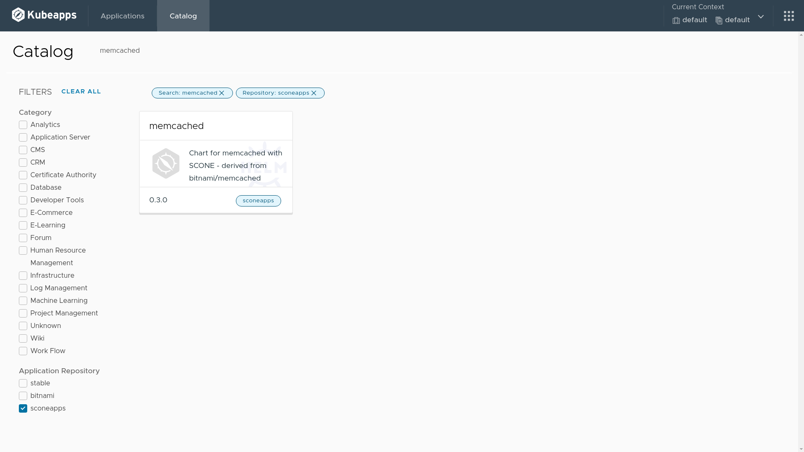
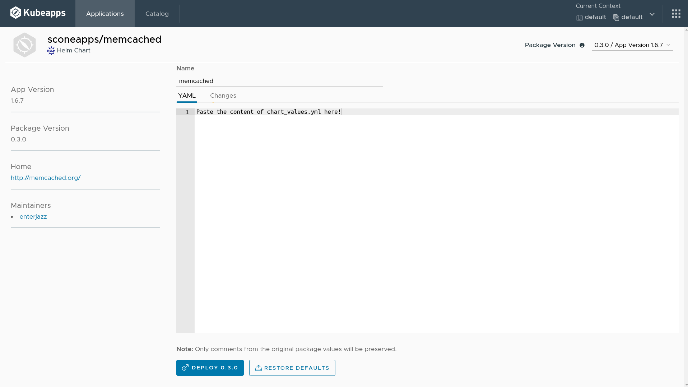
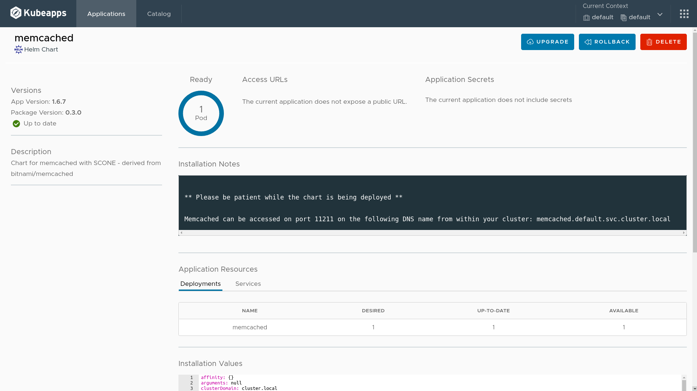

# Using Kubeapps to deploy a confidential application from SCONEAPPS helm repository

This demonstration guides you through the use of Kubeapps to deploy one of our curated confidential applications, the Memcached.

## Prerequisites

- A Kubernetes cluster
- [Kubeapps setup](https://sconedocs.github.io/kubeapps/) performed

## Upload policies

To deploy Memcached with Kubeapps, you need to upload the policies to CAS first. In this example, we also use a Memcached client to see Memcached in action. In this case, the Memcached session exports a certificate and a key to be used by the client since the Memcached has TLS enabled.

Execute the `pull_images_and_determine_mrenclaves.sh` script to pull the latests images for Memcached and determine its MRENCLAVE. Also, the image for the the client will be pulled.

```bash
./pull_images_and_determine_mrenclaves.sh
```

Submit the policies with the help of SCONE CLI:

```bash
alias scone="docker run -it --rm \
    -v /var/run/docker.sock:/var/run/docker.sock \
    -v \"$HOME/.docker/config.json:/root/.docker/config.json\" \
    -v \"\$PWD:/root\" \
    -w /root \
    registry.scontain.com:5050/community/cli "
```

```bash
scone ./upload_policies.sh
```


## Deploy a new release using the Kubeapps dashboard

Search for `memcached` in Kubeapps catalog. 



Click on the `deploy` button.



Fill the release name on the top with `memcached`.

Delete the content of the YAML text field. Copy the content of the file `chart_values.yml` generated by the previous step in the terminal and paste into the text field.

Now, click on `deploy 0.3.0` button.

After a few seconds, you will see one Pod ready, like in the following figure.




## Deploy a client to see Memcached in action

Load the environment variables generated by the upload policies step.

```bash
source client_env
```

Apply the Memcached client to see the Memcached in action.

```bash
envsubst < client_deployment.yml | kubectl apply -f -
```

You can see the logs in using the following command.

```bash
kubectl logs -f $(kubectl get pods -o=jsonpath='{.items[0].metadata.name}' \
    -l app=memcached-client)
```

